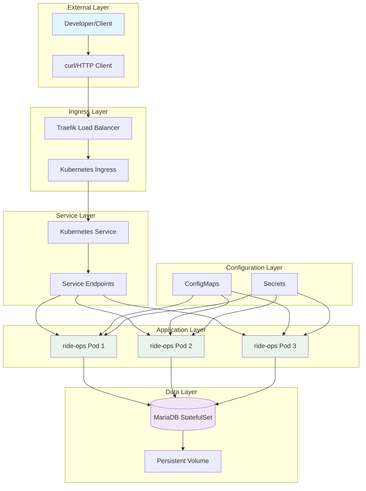

# Theme Park Ride Operations - System Design Document

A comprehensive system design document with flowcharts, UML diagrams, and data flow visualizations for the Theme Park Ride Operations system.

## 📋 Table of Contents

1. [System Overview](#system-overview)
2. [High-Level Architecture Flow](#high-level-architecture-flow)
3. [Component Interaction Diagrams](#component-interaction-diagrams)
4. [Data Flow Diagrams](#data-flow-diagrams)
5. [Sequence Diagrams](#sequence-diagrams)
6. [Deployment Flow](#deployment-flow)
7. [Database Schema](#database-schema)
8. [API Flow Diagrams](#api-flow-diagrams)
9. [Error Handling Flow](#error-handling-flow)
10. [Monitoring and Health Check Flow](#monitoring-and-health-check-flow)

---

## 🏗️ System Overview

### System Context Diagram

```text
┌─────────────────────────────────────────────────────────────────────────┐
│                         EXTERNAL CONTEXT                                │
└─────────────────────────────────────────────────────────────────────────┘
                                    │
                            ┌───────▼───────┐
                            │   Developer   │
                            │   (Client)    │
                            └───────┬───────┘
                                    │
                                    ▼
┌─────────────────────────────────────────────────────────────────────────┐
│                    THEME PARK RIDE OPERATIONS                           │
│                         SYSTEM BOUNDARY                                 │
│                                                                         │
│  ┌─────────────┐    ┌─────────────┐    ┌─────────────┐                 │
│  │   API       │    │ Business    │    │  Data       │                 │
│  │   Layer     │◄──►│ Logic       │◄──►│  Layer      │                 │
│  │             │    │ Layer       │    │             │                 │
│  └─────────────┘    └─────────────┘    └─────────────┘                 │
│                                                                         │
└─────────────────────────────────────────────────────────────────────────┘
                                    │
                            ┌───────▼───────┐
                            │   Database    │
                            │   (MariaDB)   │
                            └───────────────┘
```

---

## 🔄 High-Level Architecture Flow

### System Architecture Flowchart



---

## 🔗 Component Interaction Diagrams

### Component Diagram (UML)

```text
┌─────────────────────────────────────────────────────────────────────────┐
│                         COMPONENT DIAGRAM                               │
└─────────────────────────────────────────────────────────────────────────┘

┌─────────────────────────────────────────────────────────────────────────┐
│                           PRESENTATION LAYER                            │
├─────────────────────────────────────────────────────────────────────────┤
│  ┌─────────────────┐                    ┌─────────────────┐              │
│  │  HTTP Client    │                    │  Traefik        │              │
│  │  (curl/browser) │────────────────────│  Ingress        │              │
│  │                 │      HTTP/REST     │  Controller     │              │
│  └─────────────────┘                    └─────────────────┘              │
└─────────────────────────────────────────────────────────────────────────┘
                                                    │
                                          ┌─────────▼─────────┐
                                          │  Kubernetes       │
                                          │  Service          │
                                          │  (Load Balancer)  │
                                          └─────────┬─────────┘
                                                    │
┌─────────────────────────────────────────────────┼─────────────────────────┐
│                        APPLICATION LAYER        │                         │
├─────────────────────────────────────────────────┼─────────────────────────┤
│  ┌─────────────────────────────────────────────┐│                         │
│  │              Spring Boot Pods               ││                         │
│  │  ┌─────────────┐ ┌─────────────┐ ┌─────────┐││                         │
│  │  │    Pod 1    │ │    Pod 2    │ │  Pod 3  │││                         │
│  │  │ ┌─────────┐ │ │ ┌─────────┐ │ │┌───────┐│││                         │
│  │  │ │Controller│ │ │ │Controller│ │ ││Control││││                         │
│  │  │ │  Layer   │ │ │ │  Layer   │ │ ││Layer  │││◄────────────────────────┤
│  │  │ └─────┬───┘ │ │ └─────┬───┘ │ │└───┬───┘│││                         │
│  │  │       │     │ │       │     │ │    │    │││                         │
│  │  │ ┌─────▼───┐ │ │ ┌─────▼───┐ │ │┌───▼───┐│││                         │
│  │  │ │ Service │ │ │ │ Service │ │ ││Service││││                         │
│  │  │ │  Layer  │ │ │ │  Layer  │ │ ││Layer  │││                         │
│  │  │ └─────┬───┘ │ │ └─────┬───┘ │ │└───┬───┘│││                         │
│  │  │       │     │ │       │     │ │    │    │││                         │
│  │  │ ┌─────▼───┐ │ │ ┌─────▼───┐ │ │┌───▼───┐│││                         │
│  │  │ │Repository│ │ │ │Repository│ │ ││Repos  ││││                         │
│  │  │ │  Layer  │ │ │ │  Layer  │ │ ││Layer  │││                         │
│  │  │ └─────┬───┘ │ │ └─────┬───┘ │ │└───┬───┘│││                         │
│  │  └───────┼─────┘ └───────┼─────┘ └────┼────┘││                         │
│  └──────────┼─────────────────┼─────────────┼─────┘│                         │
└─────────────┼─────────────────┼─────────────┼──────┼─────────────────────────┘
              │                 │             │      │
┌─────────────┼─────────────────┼─────────────┼──────┼─────────────────────────┐
│             │      DATA LAYER │             │      │                         │
├─────────────▼─────────────────▼─────────────▼──────▼─────────────────────────┤
│  ┌─────────────────────────────────────────────────────────────────────────┐ │
│  │                    Database Connection Pool                             │ │
│  └─────────────────────────┬───────────────────────────────────────────────┘ │
│                            │                                                 │
│  ┌─────────────────────────▼───────────────────────────────────────────────┐ │
│  │                      MariaDB StatefulSet                               │ │
│  │  ┌─────────────┐  ┌─────────────┐  ┌─────────────┐                     │ │
│  │  │  Database   │  │   Schema    │  │ Data Files  │                     │ │
│  │  │   Engine    │  │ (themepark) │  │    (PVC)    │                     │ │
│  │  │             │  │             │  │             │                     │ │
│  │  └─────────────┘  └─────────────┘  └─────────────┘                     │ │
│  └─────────────────────────────────────────────────────────────────────────┘ │
└─────────────────────────────────────────────────────────────────────────────┘
```

---

## 📊 Data Flow Diagrams

### Level 0: Context Data Flow Diagram

```text
┌─────────────────────────────────────────────────────────────────────────┐
│                     LEVEL 0 - CONTEXT DIAGRAM                          │
└─────────────────────────────────────────────────────────────────────────┘

                    ┌─────────────────┐
                    │   Developer     │
                    │   (External     │
                    │    Entity)      │
                    └─────────┬───────┘
                              │
                   ┌──────────▼──────────┐
                   │  HTTP Requests      │
                   │  (JSON Payload)     │
                   └──────────┬──────────┘
                              │
                              ▼
┌─────────────────────────────────────────────────────────────────────────┐
│                                                                         │
│                 THEME PARK RIDE OPERATIONS                              │
│                        SYSTEM                                           │
│                       (Process)                                         │
│                                                                         │
└─────────────────────────────┬───────────────────────────────────────────┘
                              │
                   ┌──────────▼──────────┐
                   │  HTTP Responses     │
                   │  (JSON Data)        │
                   └──────────┬──────────┘
                              │
                    ┌─────────▼───────┐
                    │   Developer     │
                    │   (Response)    │
                    └─────────────────┘
```

### Level 1: System Data Flow Diagram

```text
┌─────────────────────────────────────────────────────────────────────────┐
│                     LEVEL 1 - SYSTEM BREAKDOWN                         │
└─────────────────────────────────────────────────────────────────────────┘

                           ┌─────────────┐
                           │  Developer  │
                           └─────┬───────┘
                                 │
                    ┌────────────▼────────────┐
                    │    HTTP Request         │
                    │ (GET/POST /ride)        │
                    └────────────┬────────────┘
                                 │
┌────────────────────────────────▼────────────────────────────────────────┐
│  1.0 PROCESS REQUEST                                                    │
│  ┌─────────────────┐      ┌─────────────────┐      ┌─────────────────┐  │
│  │   1.1 Validate  │      │   1.2 Route     │      │   1.3 Execute   │  │
│  │   Request       │─────▶│   Request       │─────▶│   Business      │  │
│  │                 │      │                 │      │   Logic         │  │
│  └─────────────────┘      └─────────────────┘      └─────┬───────────┘  │
└──────────────────────────────────────────────────────────┼──────────────┘
                                                           │
                              ┌────────────────────────────▼──────────────┐
                              │        Database Query                     │
                              │    (SQL: SELECT/INSERT)                   │
                              └────────────────────────────┬──────────────┘
                                                           │
┌──────────────────────────────────────────────────────────▼──────────────┐
│  2.0 DATA STORAGE                                                       │
│  ┌─────────────────┐      ┌─────────────────┐      ┌─────────────────┐  │
│  │   2.1 Execute   │      │   2.2 Return    │      │   2.3 Cache     │  │
│  │   SQL Query     │─────▶│   Result Set    │─────▶│   Results       │  │
│  │                 │      │                 │      │   (Optional)    │  │
│  └─────────────────┘      └─────────────────┘      └─────────────────┘  │
└──────────────────────────────────────────────────────────┬──────────────┘
                                                           │
                              ┌────────────────────────────▼──────────────┐
                              │       Database Result                     │
                              │    (Ride Data/Success)                    │
                              └────────────────────────────┬──────────────┘
                                                           │
┌──────────────────────────────────────────────────────────▼──────────────┐
│  3.0 FORMAT RESPONSE                                                    │
│  ┌─────────────────┐      ┌─────────────────┐      ┌─────────────────┐  │
│  │   3.1 Transform │      │   3.2 Serialize │      │   3.3 Add       │  │
│  │   Data Model    │─────▶│   to JSON       │─────▶│   HTTP Headers  │  │
│  │                 │      │                 │      │                 │  │
│  └─────────────────┘      └─────────────────┘      └─────┬───────────┘  │
└──────────────────────────────────────────────────────────┼──────────────┘
                                                           │
                              ┌────────────────────────────▼──────────────┐
                              │       HTTP Response                       │
                              │    (JSON + Status Code)                   │
                              └────────────────────────────┬──────────────┘
                                                           │
                                         ┌─────────────────▼┐
                                         │    Developer     │
                                         │   (Response)     │
                                         └──────────────────┘
```

---

## 🔄 Sequence Diagrams

### API Request Sequence Diagram

```text
┌─────────────────────────────────────────────────────────────────────────┐
│                         SEQUENCE DIAGRAM                                │
│                      API Request Flow                                   │
└─────────────────────────────────────────────────────────────────────────┘

Developer   Traefik    K8s Service   Spring Boot   Repository   MariaDB
    │           │            │            │            │           │
    │ HTTP POST  │            │            │            │           │
    │ /ride      │            │            │            │           │
    ├───────────▶│            │            │            │           │
    │           │ Forward    │            │            │           │
    │           │ Request    │            │            │           │
    │           ├───────────▶│            │            │           │
    │           │           │ Route to   │            │           │
    │           │           │ Pod        │            │           │
    │           │           ├───────────▶│            │           │
    │           │           │           │ @PostMapping│           │
    │           │           │           │ validate   │           │
    │           │           │           │ request    │           │
    │           │           │           │            │           │
    │           │           │           │ Call       │           │
    │           │           │           │ Repository │           │
    │           │           │           ├───────────▶│           │
    │           │           │           │           │ Execute   │
    │           │           │           │           │ SQL       │
    │           │           │           │           ├──────────▶│
    │           │           │           │           │          │
    │           │           │           │           │ Return   │
    │           │           │           │           │ Entity   │
    │           │           │           │           │◄─────────┤
    │           │           │           │           │          │
    │           │           │           │ Return    │          │
    │           │           │           │ Saved     │          │
    │           │           │           │ Entity    │          │
    │           │           │           │◄──────────┤          │
    │           │           │           │           │          │
    │           │           │ JSON      │           │          │
    │           │           │ Response  │           │          │
    │           │           │ 200 OK    │           │          │
    │           │           │◄──────────┤           │          │
    │           │           │           │           │          │
    │           │ Forward   │           │           │          │
    │           │ Response  │           │           │          │
    │           │◄──────────┤           │           │          │
    │           │           │           │           │          │
    │ JSON      │           │           │           │          │
    │ Response  │           │           │           │          │
    │◄──────────┤           │           │           │          │
    │           │           │           │           │          │
    ▼           ▼           ▼           ▼           ▼          ▼

Timeline: ~100-500ms total response time
```

### Health Check Sequence Diagram

```text
┌─────────────────────────────────────────────────────────────────────────┐
│                    HEALTH CHECK SEQUENCE                                │
└─────────────────────────────────────────────────────────────────────────┘

Kubernetes   Spring Boot   Actuator    Database    Application
Probes       Application   Endpoint    Health      Status
    │             │           │           │           │
    │ Liveness    │           │           │           │
    │ Probe       │           │           │           │
    ├────────────▶│           │           │           │
    │             │ Call      │           │           │
    │             │ /actuator │           │           │
    │             │ /health   │           │           │
    │             ├──────────▶│           │           │
    │             │           │ Check     │           │
    │             │           │ Database  │           │
    │             │           ├──────────▶│           │
    │             │           │           │ Test      │
    │             │           │           │ Query     │
    │             │           │           ├──────────▶│
    │             │           │           │           │
    │             │           │           │ Status    │
    │             │           │           │ OK        │
    │             │           │           │◄──────────┤
    │             │           │           │           │
    │             │           │ DB UP     │           │
    │             │           │◄──────────┤           │
    │             │           │           │           │
    │             │ {"status":│           │           │
    │             │  "UP"}    │           │           │
    │             │◄──────────┤           │           │
    │             │           │           │           │
    │ 200 OK      │           │           │           │
    │◄────────────┤           │           │           │
    │             │           │           │           │
    │ Readiness   │           │           │           │
    │ Probe       │           │           │           │
    ├────────────▶│           │           │           │
    │             │ (Same     │           │           │
    │             │  Flow)    │           │           │
    │             │◄──────────┤           │           │
    │ 200 OK      │           │           │           │
    │◄────────────┤           │           │           │
    ▼             ▼           ▼           ▼           ▼

Frequency: Every 30s (liveness), Every 10s (readiness)
```

---

## 🚀 Deployment Flow

### Deployment Process Flowchart

```text
┌─────────────────────────────────────────────────────────────────────────┐
│                      DEPLOYMENT FLOWCHART                               │
└─────────────────────────────────────────────────────────────────────────┘

                         ┌─────────────────┐
                         │   Developer     │
                         │ runs deploy     │
                         │  script         │
                         └─────────┬───────┘
                                   │
                         ┌─────────▼───────┐
                         │ Check Prerequisites│
                         │ (k3d, kubectl,  │
                         │  docker)        │
                         └─────────┬───────┘
                                   │
                              ┌────▼─────┐
                              │ Missing? │
                              └────┬─────┘
                                   │
                          ┌────────▼────────┐
                          │      Yes        │         │ No
                          │                 │         │
                    ┌─────▼─────┐          │    ┌─────▼─────┐
                    │ Install   │          │    │ Continue  │
                    │ Tools     │          │    │ Process   │
                    └─────┬─────┘          │    └─────┬─────┘
                          │                 │          │
                          └─────────────────┼──────────┘
                                           │
                                  ┌────────▼────────┐
                                  │ Create k3d      │
                                  │ Cluster         │
                                  └────────┬────────┘
                                           │
                                  ┌────────▼────────┐
                                  │ Build Spring    │
                                  │ Boot JAR        │
                                  │ (./gradlew)     │
                                  └────────┬────────┘
                                           │
                                  ┌────────▼────────┐
                                  │ Build Docker    │
                                  │ Image           │
                                  └────────┬────────┘
                                           │
                                  ┌────────▼────────┐
                                  │ Import Image    │
                                  │ to k3d          │
                                  └────────┬────────┘
                                           │
                                  ┌────────▼────────┐
                                  │ Create          │
                                  │ Namespace       │
                                  └────────┬────────┘
                                           │
                                  ┌────────▼────────┐
                                  │ Deploy MariaDB  │
                                  │ StatefulSet     │
                                  └────────┬────────┘
                                           │
                                  ┌────────▼────────┐
                                  │ Wait for DB     │
                                  │ Ready           │
                                  └────────┬────────┘
                                           │
                                  ┌────────▼────────┐
                                  │ Create Secrets  │
                                  │ & ConfigMaps    │
                                  └────────┬────────┘
                                           │
                                  ┌────────▼────────┐
                                  │ Deploy          │
                                  │ Application     │
                                  └────────┬────────┘
                                           │
                                  ┌────────▼────────┐
                                  │ Wait for Pods   │
                                  │ Ready (3/3)     │
                                  └────────┬────────┘
                                           │
                                  ┌────────▼────────┐
                                  │ Verify Health   │
                                  │ Checks          │
                                  └────────┬────────┘
                                           │
                                  ┌────────▼────────┐
                                  │ Display         │
                                  │ Success Info    │
                                  └─────────────────┘
```

---

## 🗄️ Database Schema

### Entity Relationship Diagram

```text
┌─────────────────────────────────────────────────────────────────────────┐
│                         DATABASE SCHEMA                                 │
└─────────────────────────────────────────────────────────────────────────┘

                    ┌─────────────────────────────────┐
                    │        theme_park_ride          │
                    ├─────────────────────────────────┤
                    │ id (PK)          BIGINT         │
                    │ name             VARCHAR(255)   │
                    │ description      TEXT           │
                    │ thrill_factor    INTEGER        │
                    │ vomit_factor     INTEGER        │
                    │ created_date     TIMESTAMP      │
                    │ updated_date     TIMESTAMP      │
                    └─────────────────────────────────┘

┌─────────────────────────────────────────────────────────────────────────┐
│                         SAMPLE DATA                                     │
├─────────────────────────────────────────────────────────────────────────┤
│ ID │ Name          │ Description                    │ Thrill │ Vomit   │
├────┼───────────────┼────────────────────────────────┼────────┼─────────┤
│ 1  │ Rollercoaster │ Train ride that speeds you     │   5    │   3     │
│    │               │ along.                         │        │         │
├────┼───────────────┼────────────────────────────────┼────────┼─────────┤
│ 2  │ Log flume     │ Boat ride with plenty of       │   3    │   2     │
│    │               │ splashes.                      │        │         │
├────┼───────────────┼────────────────────────────────┼────────┼─────────┤
│ 3  │ Teacups       │ Spinning ride in a giant       │   2    │   4     │
│    │               │ tea-cup.                       │        │         │
└────┴───────────────┴────────────────────────────────┴────────┴─────────┘

┌─────────────────────────────────────────────────────────────────────────┐
│                      VALIDATION RULES                                   │
├─────────────────────────────────────────────────────────────────────────┤
│ • name: Not null, max 255 characters                                   │
│ • description: Optional, text field                                    │
│ • thrill_factor: Integer, range 1-5                                   │
│ • vomit_factor: Integer, range 1-5                                    │
│ • created_date: Auto-generated on insert                              │
│ • updated_date: Auto-updated on modification                          │
└─────────────────────────────────────────────────────────────────────────┘
```

### Database Connection Flow

```text
┌─────────────────────────────────────────────────────────────────────────┐
│                    DATABASE CONNECTION FLOW                             │
└─────────────────────────────────────────────────────────────────────────┘

Spring Boot         HikariCP           MariaDB           Persistent
Application      Connection Pool      StatefulSet         Volume
     │                 │                  │                 │
     │ Request         │                  │                 │
     │ Connection      │                  │                 │
     ├────────────────▶│                  │                 │
     │                 │ Get/Create       │                 │
     │                 │ Connection       │                 │
     │                 ├─────────────────▶│                 │
     │                 │                  │ Read/Write      │
     │                 │                  │ Data            │
     │                 │                  ├────────────────▶│
     │                 │                  │                 │
     │                 │                  │ Data            │
     │                 │                  │ Persisted       │
     │                 │                  │◄────────────────┤
     │                 │                  │                 │
     │                 │ Return           │                 │
     │                 │ Result           │                 │
     │                 │◄─────────────────┤                 │
     │                 │                  │                 │
     │ Return          │                  │                 │
     │ Connection      │                  │                 │
     │◄────────────────┤                  │                 │
     ▼                 ▼                  ▼                 ▼

Connection Pool Settings:
• Maximum Pool Size: 10
• Minimum Idle: 5
• Connection Timeout: 30s
• Idle Timeout: 600s
```

---

## 🔗 API Flow Diagrams

### GET /ride Endpoint Flow

```text
┌─────────────────────────────────────────────────────────────────────────┐
│                      GET /ride FLOW                                     │
└─────────────────────────────────────────────────────────────────────────┘

    HTTP GET /ride
          │
          ▼
┌─────────────────────┐
│ ThemeParkRide       │
│ Controller          │
│ @GetMapping("/ride")│
└─────────┬───────────┘
          │
          ▼
┌─────────────────────┐
│ Validate Request    │
│ • Check Headers     │
│ • Auth (Future)     │
└─────────┬───────────┘
          │
          ▼
┌─────────────────────┐
│ ThemeParkRide       │
│ Repository          │
│ .findAll()          │
└─────────┬───────────┘
          │
          ▼
┌─────────────────────┐
│ CrudRepository      │
│ Implementation      │
│ (Spring Data JPA)   │
└─────────┬───────────┘
          │
          ▼
┌─────────────────────┐
│ Generate SQL        │
│ SELECT * FROM       │
│ theme_park_ride     │
└─────────┬───────────┘
          │
          ▼
┌─────────────────────┐
│ Execute on          │
│ MariaDB             │
│ Database            │
└─────────┬───────────┘
          │
          ▼
┌─────────────────────┐
│ Transform Result    │
│ Set to Entity List  │
└─────────┬───────────┘
          │
          ▼
┌─────────────────────┐
│ Serialize to JSON   │
│ (Jackson)           │
└─────────┬───────────┘
          │
          ▼
┌─────────────────────┐
│ HTTP Response       │
│ 200 OK + JSON      │
│ Content-Type:       │
│ application/json    │
└─────────────────────┘
```

### POST /ride Endpoint Flow

```text
┌─────────────────────────────────────────────────────────────────────────┐
│                     POST /ride FLOW                                     │
└─────────────────────────────────────────────────────────────────────────┘

HTTP POST /ride + JSON Body
          │
          ▼
┌─────────────────────┐
│ ThemeParkRide       │
│ Controller          │
│ @PostMapping        │
└─────────┬───────────┘
          │
          ▼
┌─────────────────────┐
│ Validate JSON       │
│ • @Valid annotation │
│ • Field validation  │
│ • Required fields   │
└─────────┬───────────┘
          │
          ▼
┌─────────────────────┐      ┌─────────────────────┐
│ Validation Failed?  │ Yes  │ Return 400 Bad      │
│                     │─────▶│ Request + Errors    │
└─────────┬───────────┘      └─────────────────────┘
          │ No
          ▼
┌─────────────────────┐
│ Deserialize JSON    │
│ to ThemeParkRide    │
│ Entity              │
└─────────┬───────────┘
          │
          ▼
┌─────────────────────┐
│ Set Timestamps      │
│ • created_date      │
│ • updated_date      │
└─────────┬───────────┘
          │
          ▼
┌─────────────────────┐
│ Repository.save()   │
│ (Spring Data JPA)   │
└─────────┬───────────┘
          │
          ▼
┌─────────────────────┐
│ Generate INSERT SQL │
│ INSERT INTO         │
│ theme_park_ride...  │
└─────────┬───────────┘
          │
          ▼
┌─────────────────────┐
│ Execute on MariaDB  │
│ Return Generated ID │
└─────────┬───────────┘
          │
          ▼
┌─────────────────────┐
│ Return Saved Entity │
│ with Generated ID   │
└─────────┬───────────┘
          │
          ▼
┌─────────────────────┐
│ Serialize to JSON   │
│ HTTP 200 OK         │
└─────────────────────┘
```

---

## ⚠️ Error Handling Flow

### Error Handling Flowchart

```text
┌─────────────────────────────────────────────────────────────────────────┐
│                      ERROR HANDLING FLOW                                │
└─────────────────────────────────────────────────────────────────────────┘

          Request
             │
             ▼
    ┌─────────────────┐
    │ Controller      │
    │ Method          │
    └────────┬────────┘
             │
             ▼
    ┌─────────────────┐
    │ Try Processing  │
    └────────┬────────┘
             │
        ┌────▼─────┐
        │ Error?   │
        └────┬─────┘
             │
    ┌────────▼────────┐ ┌─────────────────────────────────────────────────┐
    │     Yes         │ │                 No                              │
    │                 │ │                                                 │
    ▼                 │ ▼                                                 │
┌─────────────┐      │ ┌─────────────────┐                               │
│ Exception   │      │ │ Normal          │                               │
│ Type?       │      │ │ Response        │                               │
└─────┬───────┘      │ └─────────────────┘                               │
      │              │                                                   │
┌─────▼──────────────┼─────────────────────────────────────────────────┐ │
│ Validation Error   │                                                 │ │
│ (400 Bad Request)  │                                                 │ │
├────────────────────┼─────────────────────────────────────────────────┤ │
│ • Field validation │                                                 │ │
│ • JSON parse error │                                                 │ │
│ • Missing fields   │                                                 │ │
└────────────────────┼─────────────────────────────────────────────────┘ │
                     │                                                   │
┌────────────────────┼─────────────────────────────────────────────────┐ │
│ Resource Not Found │                                                 │ │
│ (404 Not Found)    │                                                 │ │
├────────────────────┼─────────────────────────────────────────────────┤ │
│ • Ride ID not found│                                                 │ │
│ • Invalid endpoint │                                                 │ │
└────────────────────┼─────────────────────────────────────────────────┘ │
                     │                                                   │
┌────────────────────┼─────────────────────────────────────────────────┐ │
│ Database Error     │                                                 │ │
│ (500 Internal)     │                                                 │ │
├────────────────────┼─────────────────────────────────────────────────┤ │
│ • Connection lost  │                                                 │ │
│ • SQL syntax error │                                                 │ │
│ • Constraint violation│                                              │ │
└────────────────────┼─────────────────────────────────────────────────┘ │
                     │                                                   │
┌────────────────────┼─────────────────────────────────────────────────┐ │
│ Generic Error      │                                                 │ │
│ (500 Internal)     │                                                 │ │
├────────────────────┼─────────────────────────────────────────────────┤ │
│ • Unexpected error │                                                 │ │
│ • System failure   │                                                 │ │
└────────────────────┼─────────────────────────────────────────────────┘ │
                     │                                                   │
                     ▼                                                   │
           ┌─────────────────┐                                          │
           │ Format Error    │                                          │
           │ Response        │                                          │
           │ {               │                                          │
           │   "error": "...",│                                         │
           │   "message":"...",│                                        │
           │   "timestamp":...│                                         │
           │ }               │                                          │
           └─────────┬───────┘                                          │
                     │                                                   │
                     └───────────────┬───────────────────────────────────┘
                                     │
                            ┌────────▼────────┐
                            │ Return HTTP     │
                            │ Error Response  │
                            └─────────────────┘
```

---

## 📊 Monitoring and Health Check Flow

### Health Check Architecture

```text
┌─────────────────────────────────────────────────────────────────────────┐
│                    HEALTH CHECK ARCHITECTURE                            │
└─────────────────────────────────────────────────────────────────────────┘

┌─────────────────────────────────────────────────────────────────────────┐
│                        KUBERNETES LAYER                                 │
├─────────────────────────────────────────────────────────────────────────┤
│                                                                         │
│  ┌─────────────────┐               ┌─────────────────┐                  │
│  │  Liveness       │               │  Readiness      │                  │
│  │  Probe          │               │  Probe          │                  │
│  │                 │               │                 │                  │
│  │ • Delay: 60s    │               │ • Delay: 30s    │                  │
│  │ • Interval: 30s │               │ • Interval: 10s │                  │
│  │ • Timeout: 5s   │               │ • Timeout: 5s   │                  │
│  │ • Retries: 3    │               │ • Retries: 3    │                  │
│  └─────────┬───────┘               └─────────┬───────┘                  │
│            │                                 │                          │
└────────────┼─────────────────────────────────┼──────────────────────────┘
             │                                 │
┌────────────┼─────────────────────────────────┼──────────────────────────┐
│            │          APPLICATION LAYER      │                          │
├────────────┼─────────────────────────────────┼──────────────────────────┤
│            │                                 │                          │
│            ▼                                 ▼                          │
│  ┌─────────────────────────────────────────────────────────────┐        │
│  │               /actuator/health                              │        │
│  │                                                             │        │
│  │ ┌─────────────┐  ┌─────────────┐  ┌─────────────┐          │        │
│  │ │   System    │  │  Database   │  │ Application │          │        │
│  │ │   Health    │  │   Health    │  │   Health    │          │        │
│  │ │             │  │             │  │             │          │        │
│  │ │ • Disk      │  │ • Connection│  │ • Status    │          │        │
│  │ │ • Memory    │  │ • Pool      │  │ • Version   │          │        │
│  │ │ • CPU       │  │ • Query     │  │ • Build     │          │        │
│  │ └─────────────┘  └─────────────┘  └─────────────┘          │        │
│  └─────────────────────────────────────────────────────────────┘        │
│                                │                                        │
└────────────────────────────────┼────────────────────────────────────────┘
                                 │
┌────────────────────────────────┼────────────────────────────────────────┐
│                                │         DATABASE LAYER                │
├────────────────────────────────┼────────────────────────────────────────┤
│                                ▼                                        │
│  ┌─────────────────────────────────────────────────────────────┐        │
│  │                MariaDB Health Check                        │        │
│  │                                                             │        │
│  │ ┌─────────────┐  ┌─────────────┐  ┌─────────────┐          │        │
│  │ │ Connection  │  │   Simple    │  │   Schema    │          │        │
│  │ │   Test      │  │   Query     │  │   Check     │          │        │
│  │ │             │  │             │  │             │          │        │
│  │ │ • TCP       │  │ • SELECT 1  │  │ • Tables    │          │        │
│  │ │ • Socket    │  │ • Response  │  │ • Indexes   │          │        │
│  │ │ • Auth      │  │ • Time      │  │ • Integrity │          │        │
│  │ └─────────────┘  └─────────────┘  └─────────────┘          │        │
│  └─────────────────────────────────────────────────────────────┘        │
└─────────────────────────────────────────────────────────────────────────┘
```

### Health Check Response Flow

```text
┌─────────────────────────────────────────────────────────────────────────┐
│                   HEALTH CHECK RESPONSE FLOW                            │
└─────────────────────────────────────────────────────────────────────────┘

    GET /actuator/health
           │
           ▼
  ┌─────────────────┐
  │ HealthIndicator │
  │ Aggregation     │
  └─────┬───────────┘
        │
        ▼
┌─────────────────────┐     ┌─────────────────────┐     ┌─────────────────┐
│ Database Health     │     │ Disk Space Health   │     │ System Health   │
│ Indicator           │     │ Indicator           │     │ Indicator       │
└─────┬───────────────┘     └─────┬───────────────┘     └─────┬───────────┘
      │                           │                           │
      ▼                           ▼                           ▼
┌─────────────────┐         ┌─────────────────┐         ┌─────────────────┐
│ Execute:        │         │ Check:          │         │ Check:          │
│ SELECT 1        │         │ Available Space │         │ JVM Status      │
│ on MariaDB      │         │ > Threshold     │         │ Thread Count    │
└─────┬───────────┘         └─────┬───────────┘         └─────┬───────────┘
      │                           │                           │
      ▼                           ▼                           ▼
┌─────────────────┐         ┌─────────────────┐         ┌─────────────────┐
│ Result:         │         │ Result:         │         │ Result:         │
│ UP/DOWN         │         │ UP/DOWN         │         │ UP/DOWN         │
└─────┬───────────┘         └─────┬───────────┘         └─────┬───────────┘
      │                           │                           │
      └─────────────┬─────────────────────────┬─────────────────┘
                    │                         │
                    ▼                         ▼
            ┌─────────────────────────────────────────┐
            │        Aggregate Results                │
            │                                         │
            │ Overall Status = ALL indicators UP      │
            │ • If ANY DOWN → Overall DOWN            │
            │ • If ALL UP → Overall UP                │
            └─────────────────┬───────────────────────┘
                              │
                              ▼
                    ┌─────────────────┐
                    │ Generate JSON   │
                    │ Response:       │
                    │ {               │
                    │   "status":"UP",│
                    │   "components": │
                    │   {             │
                    │     "db": "UP", │
                    │     "disk":"UP" │
                    │   }             │
                    │ }               │
                    └─────────┬───────┘
                              │
                              ▼
                    ┌─────────────────┐
                    │ HTTP Response   │
                    │ 200 OK (UP)     │
                    │ 503 Service     │
                    │ Unavailable     │
                    │ (DOWN)          │
                    └─────────────────┘
```

---

## 🎯 Summary

This system design document provides comprehensive flowcharts and diagrams covering:

- **High-Level Architecture**: Complete system overview
- **Component Interactions**: How services communicate
- **Data Flow**: Request/response patterns
- **Sequence Diagrams**: Time-based interaction flows
- **Deployment Process**: Step-by-step deployment flow
- **Database Design**: Schema and connection patterns
- **API Flows**: Detailed endpoint processing
- **Error Handling**: Exception and error management
- **Health Monitoring**: Comprehensive health check architecture

These diagrams serve as a visual guide for understanding the Theme Park Ride Operations system architecture, making it easier for developers, operations teams, and stakeholders to understand the system's behavior and interactions.

---

## 📚 Related Documentation

- [Complete Architecture Guide](ARCHITECTURE.md) - Comprehensive architecture documentation
- [Quick Start Guide](QUICKSTART.md) - Get running in 2 commands
- [Scripts Documentation](scripts/README.md) - Detailed automation guide
- [Commands Reference](commands.txt) - All available commands

This system design provides the visual foundation for understanding how the Theme Park Ride Operations system works from request to response! 🎢✨